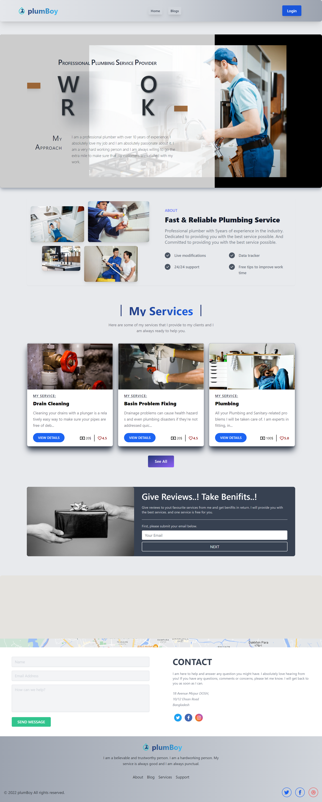
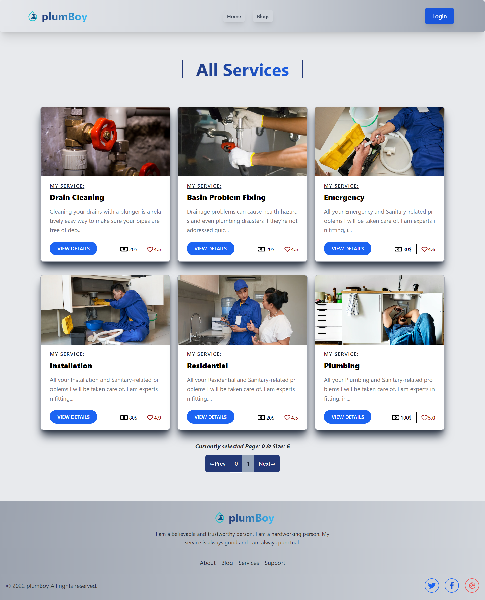
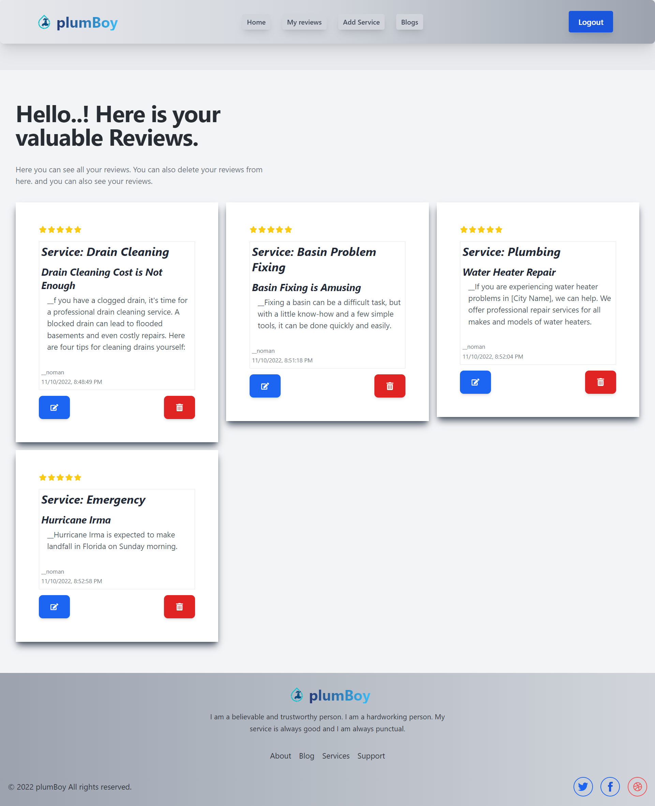
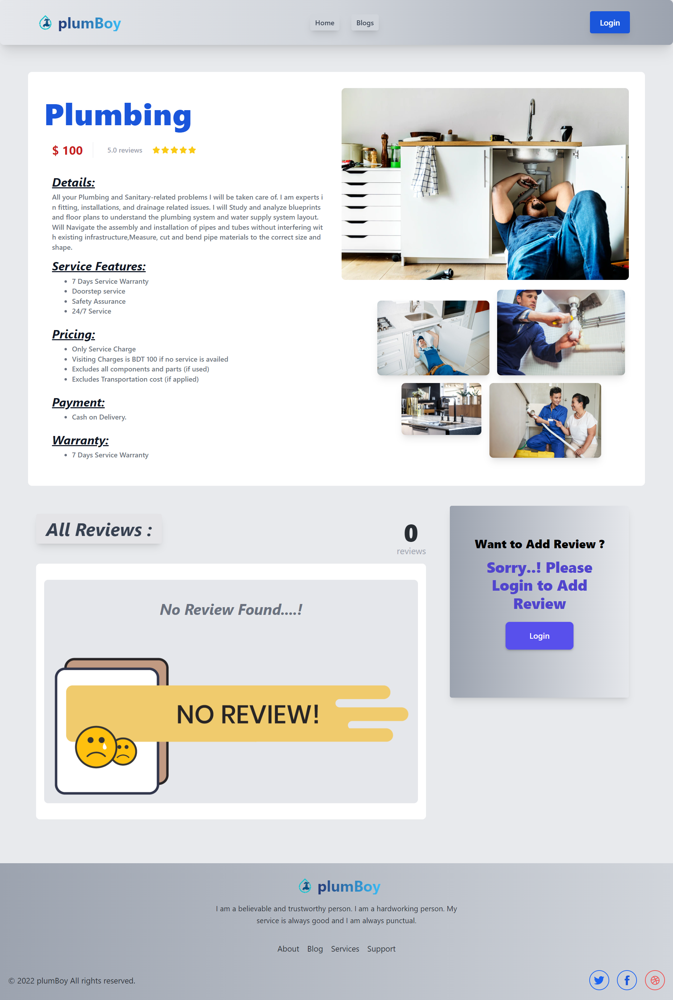
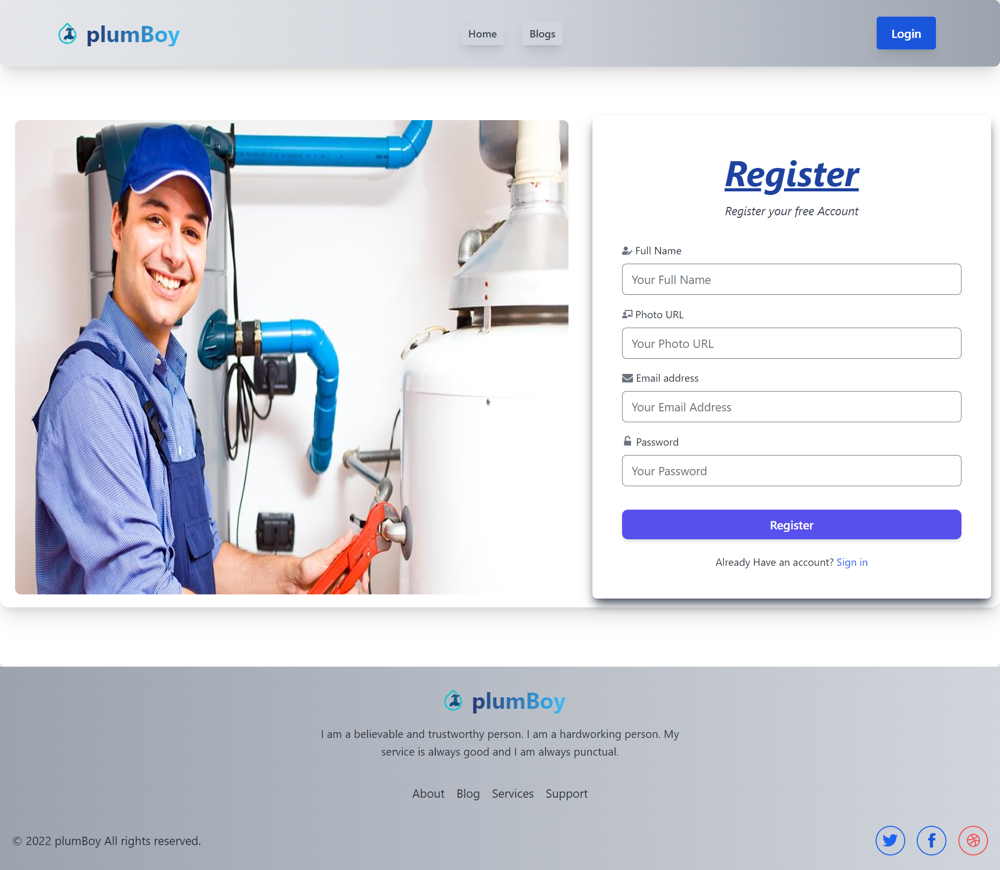
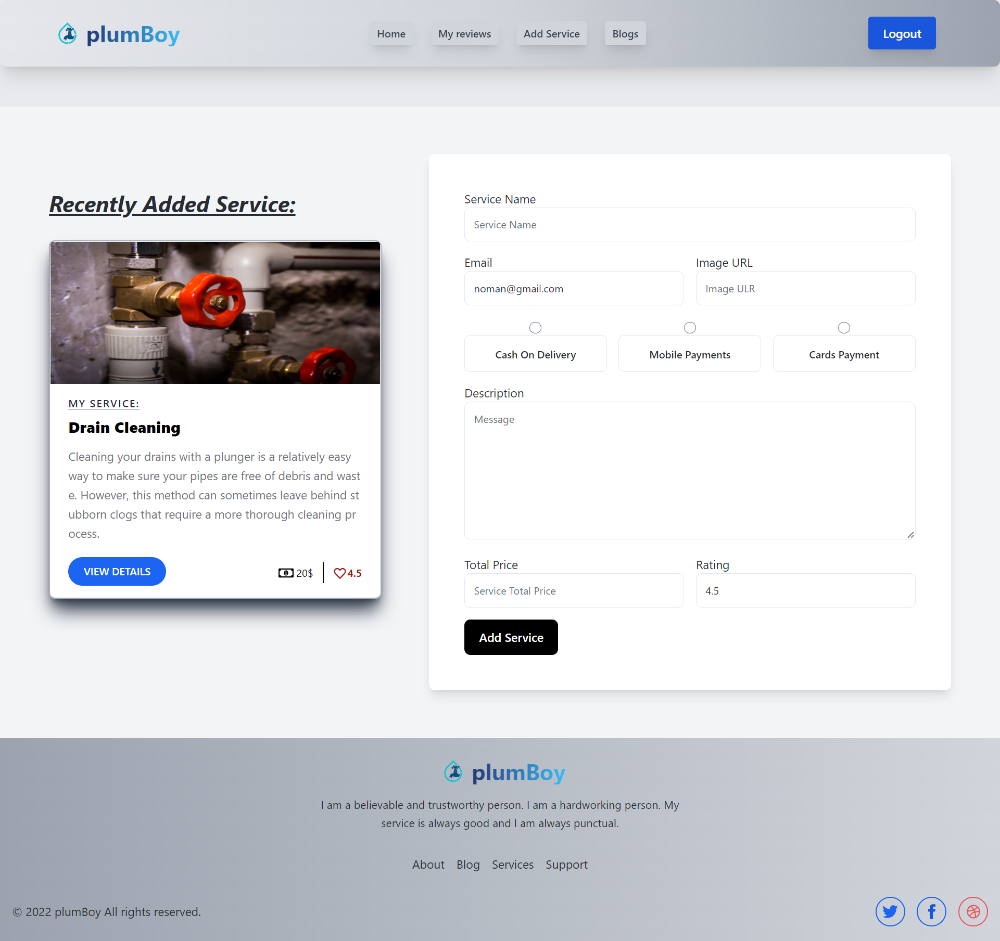
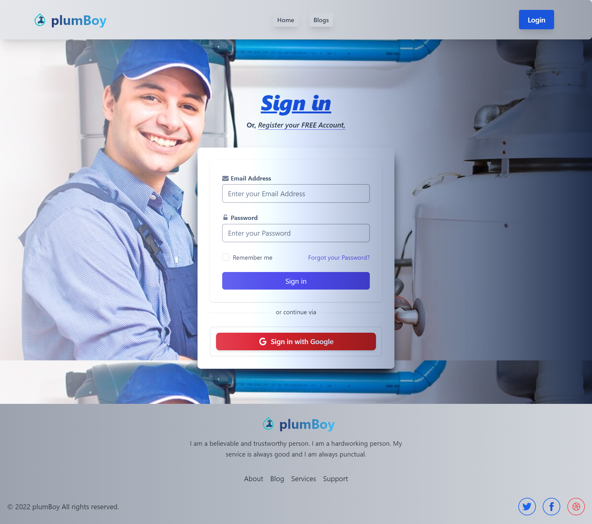

# PlumBoy (MERN Stack)

1. Live Website: https://reactjs-plumboy-service-review.web.app/
2. Server Side: https://server-plumboy-service.vercel.app/

## Description:

1. A web base application (ReactJs).
2. At "Home" page user find "My Services" section and from the recently Added services by clicking "VIEW DETAILS" user can see the "Service Details" and other users "Reviews".
3. User can add their review for the specific Services by submitting Review form.But for that, user have to be Loged in,if the user is new user can register themselves. 
4. At Home Page under the Services, by clicking "See All" button user find all the available services and user can post their reviews for all services.
5. If user is Loged in, user can view the all Reviews they already posted at "My Reviews".
6. User can "UPDATE" and Can "DELETE" their reviews they already posted.
7. From "Add Service" page "Admin" of the system can post New Services...and It will show on the Home Page as well as All Services page.
8. System is Fully Authenticate By "Google Firebase Authentication".
9. There are also "Blog" page. From there user can find Questions and Answers.
10. System is fully responsive.
11. All Data's are hosted on the database "MongoDB" and server side hosted on "vercel".
#

## Technology Uses (Frameworks, libraries):

##### Frameworks:
1. Tailwind CSS.
2. react-router-dom

##### Libraries:
1. React JS
2. Daisy UI
3. Flowbite
4. react-hot-toast
5. react-icons
6. react-spinners
7. aos
8. sweetalert2
9. react-photo-view
10. react-helmet-async

#
## Deploy:
1. Vercel (Server Side)
2. Firebase (Client Side)

#
## Database:
1. MongoDB(NoSQL)
#

## App Demo:

### 1. Home Page:
##

##
### 2. All Services:
##

##
### 3. My Reviews:
##

##
### 4. Service Details:
##

##
### 5. Register:
##

##
### 6. Add Service:
##

##
### 7. Login:
##

##
